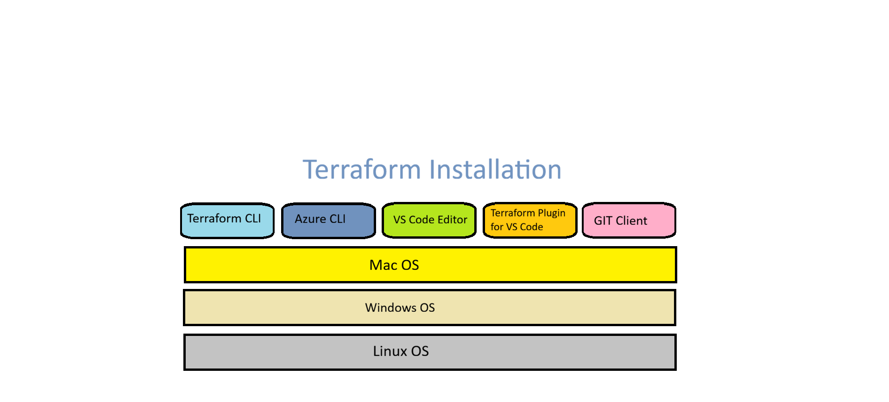

# Terraform Setup and Installation

---

<strong>Mentor:</strong> Praveen Kumar Gudla (PKsir)  
<strong>Focus Areas:</strong> Azure | DevOps | Terraform | Cloud Engineering  
<strong>Industry Experience:</strong> 17+ Years  

---

## Objective of This Session

By the end of this setup session, you will be able to:

- Install Terraform on your system
- Verify Terraform installation
- Install Azure CLI
- Login to Azure from terminal
- Prepare system for Terraform Azure labs

This setup is mandatory before starting hands-on labs.

---

## System Requirements

Minimum requirements:

- Laptop or Desktop
- Windows, Linux, or macOS
- Stable internet connection
- Azure account (Free or Pay-as-you-go)

Recommended:

- VS Code editor
- Git installed

---

## Introduction
- Install [Terraform CLI](https://www.terraform.io/downloads.html)
- Install [Azure CLI](https://docs.microsoft.com/en-us/cli/azure/install-azure-cli)
- Install [VS Code Editor](https://code.visualstudio.com/download)
- Install [HashiCorp Terraform plugin for VS Code](https://marketplace.visualstudio.com/items?itemName=HashiCorp.terraform)
- Install [Git Client](https://git-scm.com/downloads)

## Steps: WindowsOS: Terraform & Azure CLI Install
## Step 1: Install Terraform

Terraform can be installed by downloading binary from official website.

Website:  
https://developer.hashicorp.com/terraform/downloads

### For Windows

Steps:

1. Download Windows 64-bit zip file
2. Extract terraform.exe
3. Copy terraform.exe to folder (for example: C:\terraform)
4. Add that folder to System PATH environment variable

Verify installation:

Open Command Prompt or PowerShell:

terraform -version

You should see Terraform version output.

---

### For Linux

Example (Ubuntu):

sudo apt update  
sudo apt install -y gnupg software-properties-common curl

curl -fsSL https://apt.releases.hashicorp.com/gpg | sudo apt-key add -

sudo apt-add-repository "deb [arch=amd64] https://apt.releases.hashicorp.com $(lsb_release -cs) main"

sudo apt update  
sudo apt install terraform

Verify:

terraform -version

---

### For macOS

Using Homebrew:

brew tap hashicorp/tap  
brew install hashicorp/tap/terraform

Verify:

terraform -version

---

## Step 2: Install Azure CLI

Terraform uses Azure APIs, so Azure CLI is needed for authentication.

Website:  
https://learn.microsoft.com/en-us/cli/azure/install-azure-cli

### Verify Azure CLI

az version

---

## Step 3: Login to Azure

Login using browser authentication:

az login

This will open browser.  
Login using your Azure account.

After login, verify subscription:

az account show

If you have multiple subscriptions:

az account list  
az account set --subscription "<SUBSCRIPTION_ID>"

---

## Step 4: Install VS Code (Recommended)

VS Code helps in writing Terraform code easily.

Download from:  
https://code.visualstudio.com/

Recommended extensions:

- HashiCorp Terraform
- Azure CLI Tools
- YAML

These extensions help in syntax highlighting and validation.

---

## Step 5: Install Git

Git is required to:

- Download code
- Push changes to GitHub
- Work with CI/CD pipelines

Download:  
https://git-scm.com/downloads

Verify:

git --version

---

## Step 6: Create Working Directory

Create a folder for Terraform practice:

Example:

mkdir terraform-labs  
cd terraform-labs

This folder will contain all Terraform files for labs.

---

## Step 7: Test Terraform with Sample Command

Inside lab folder, run:

terraform

You should see Terraform help commands.

This confirms Terraform CLI is working.

---

## Common Setup Issues

### Terraform command not found

Reason:
- PATH not set correctly

Fix:
- Add Terraform folder to system PATH
- Restart terminal

---

### Azure login issues

Reason:
- Corporate proxy
- MFA issues

Fix:
- Try device login method:

az login --use-device-code

---

### VS Code Terraform extension not working

Fix:
- Restart VS Code
- Reinstall extension
- Check terraform binary path

---

## Important Notes for Students

- Always check terraform version before starting lab
- Do not mix Terraform versions in team projects
- Login to correct Azure subscription before applying code

Wrong subscription can create resources in wrong account.

<h2 style="color:#5B2BBF;">PKsir Message</h2>

Tools setup may look simple, but many real project issues start from incorrect or incomplete setup.

Always verify the following before running <code>terraform apply</code>:

- Terraform version
- Azure login status
- Correct Azure subscription

Proper verification at the beginning helps avoid unnecessary failures during deployment.
