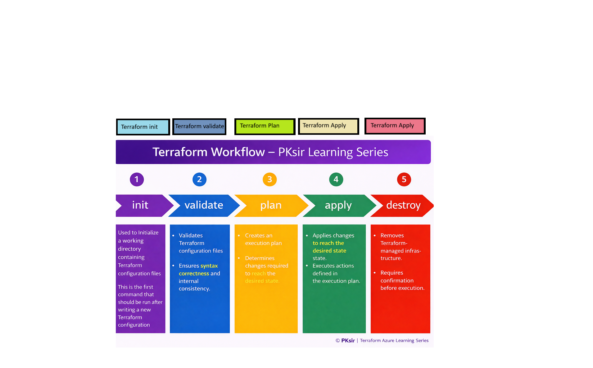

## Terraform Basic Command
---

<strong>Mentor:</strong> Praveen Kumar Gudla (PKsir)  
<strong>Focus Areas:</strong> Azure | DevOps | Terraform | Cloud Engineering  
<strong>Industry Experience:</strong> 17+ Years  

---
## Step-01: Introduction
- Understand basic Terraform Commands
1. terraform init
2. terraform validate
3. terraform plan
4. terraform apply
5. terraform destroy      

## Step 1: Write Terraform Configuration

We write Terraform files:

- resourcegroup.tf
- provider.tf

These files contain:
- provider configuration
- resource blocks

Terraform reads all .tf files in the directory together.

---

## Step 2: terraform init

Command:

terraform init

What happens during init:

- Downloads required providers
- Initializes backend (local or remote)
- Prepares working directory
- Creates .terraform folder

Without init:
- Terraform cannot run plan or apply

Init must be run:
- first time in project
- when provider version changes
- when backend changes

---
## Step 3: terraform validate

- it will check all the syntactical errors

## Step 4: terraform plan

Command:

terraform plan

What Terraform does:

- Reads Terraform code
- Reads current state file
- Queries real cloud infrastructure
- Compares desired state with current state
- Shows what will be created, updated, or deleted

Plan does NOT change anything.

It is only a preview of changes.

Always review plan before apply.

---

## Step 5: terraform apply

Command:

terraform apply

What happens during apply:

- Terraform again calculates execution plan
- Asks for confirmation (yes)
- Sends API calls to provider
- Provider creates or updates resources
- Terraform updates state file

After apply:
- Infrastructure is created or modified
- State file reflects new reality

---

## Step 6: terraform destroy

Command:

terraform destroy

What happens:

- Terraform reads state file
- Finds all resources it created
- Deletes them using provider APIs
- Updates state file

Destroy should be used carefully.

In production, destroy is usually restricted.

---

## What Happens When Code Changes

When you modify Terraform code:

terraform plan will show:

- + create
- ~ update
- - destroy

Terraform will try:
- update in place if possible
- recreate resource if required

Some changes force recreation.

Plan output clearly shows this.

---

## What Happens If Resource Is Deleted Manually

If someone deletes resource in cloud portal:

State still thinks resource exists.

During next plan/apply:

Terraform will try to recreate resource.

This is called drift detection.

Terraform helps bring infra back to desired state.

---

## Common Execution Mistakes

- Running apply without checking plan
- Running apply in wrong subscription
- Not running init after code changes
- Using old state file

Always check:
- subscription
- backend
- plan output

Before applying.

---

## Interview Questions

Q1: What does terraform init do?  
Downloads providers and initializes backend.

Q2: Does terraform plan create resources?  
No, it only shows preview.

Q3: When is state file updated?  
After successful terraform apply or destroy.

Q4: How does Terraform know resource order?  
Using dependency graph.

Q5: What is drift in Terraform?  
When real infra differs from state and code.

---

### PKsir Message

Terraform is safe when we respect the process.

Never skip these steps before running `terraform apply`:

- `terraform init`
- `terraform validate`
- `terraform plan`
- Review the execution plan carefully

Most production issues happen when engineers rush directly to **apply** without proper validation and review.

