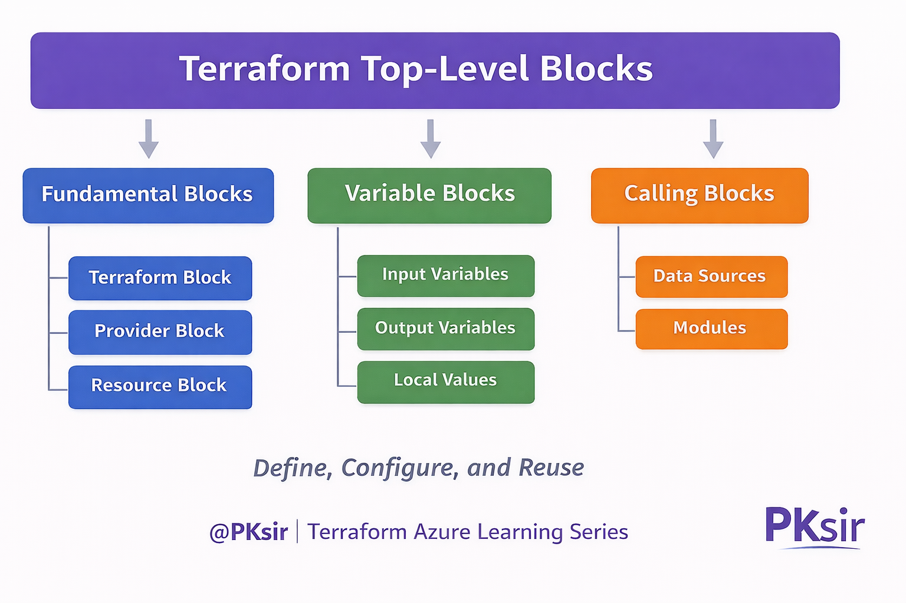

## Terraform Configuration Language Syntax
---

<span style="color:#5B2BBF;"><strong>Mentor:</strong></span> Praveen Kumar Gudla (PKsir)  
<span style="color:#5B2BBF;"><strong>Focus Areas:</strong></span> Azure | DevOps | Terraform | Cloud Engineering  
<span style="color:#5B2BBF;"><strong>Industry Experience:</strong></span> 17+ Years  

---

## Step-01: Introduction
In this session, we will understand the Terraform Configuration Language, which is used to define infrastructure using code.

Terraform uses a language called HCL (HashiCorp Configuration Language).
It is designed to be:

Easy to read
Easy to write
Human-friendly
Suitable for infrastructure automation

Before creating infrastructure using Terraform, it is important to understand the basic building blocks of the language.

In this step, we will learn:
- What are Terraform Blocks
- Arguments, Attributes, and Meta-Arguments
- Identifiers in Terraform
- Comments and their usage
- Understanding these fundamentals will make writing Terraform code much easier in upcoming sessions.


## Step-02: Terraform Configuration Language Syntax

Terraform configuration files use a structured syntax.
Every Terraform configuration is mainly built using Blocks and Arguments.

- Understand Blocks
- Understand Arguments
- Understand Identifiers
- Understand Comments
- [Terraform Configuration](https://www.terraform.io/docs/configuration/index.html)
- [Terraform Configuration Syntax](https://www.terraform.io/docs/configuration/syntax.html)
```t
# Template
<BLOCK TYPE> "<BLOCK LABEL>" "<BLOCK LABEL>"   {
  # Block body
  <IDENTIFIER> = <EXPRESSION> # Argument
}
```
## Explanation

- Block Type → Defines what you are creating (resource, provider, variable, etc.)
- Block Labels → Used to identify and reference resources
- Identifier → Argument name inside the block
- Expression → Value assigned to the argument

```t

# Azure Example
# Create a resource group
resource "azurerm_resource_group" "rg" { # Resource BLOCK
  name = "demo-rg01" # Argument
  location = "west europe" # Argument 
}
# Create Virtual Network
resource "azurerm_virtual_network" "myvnet" { # Resource BLOCK
  name                = "demo-myvnet-1" # Argument
  address_space       = ["172.16.0.0/16"]
  location            = azurerm_resource_group.myrg.location # Argument with value as expression
  resource_group_name = azurerm_resource_group.myrg.name # Argument with value as expression
}
```

## Step-03: Understand about Arguments, Attributes and Meta-Arguments.
- Arguments can be `required` or `optional`
- Attribues format looks like `resource_type.resource_name.attribute_name`
- Meta-Arguments change a resource type's behavior (Example: count, for_each)
- [Additional Reference](https://learn.hashicorp.com/tutorials/terraform/resource?in=terraform/configuration-language) 
- [Resource: Azure Resource Group](https://registry.terraform.io/providers/hashicorp/azurerm/latest/docs/data-sources/resource_group)
- [Resource: Azure Resource Group Argument Reference](https://registry.terraform.io/providers/hashicorp/azurerm/latest/docs/data-sources/resource_group#arguments-reference)
- [Resource: Azure Resource Group Attribute Reference](https://registry.terraform.io/providers/hashicorp/azurerm/latest/docs/data-sources/resource_group#attributes-reference)
- [Resource: Meta-Arguments](https://www.terraform.io/docs/language/meta-arguments/depends_on.html)

## Step-04: Understanding Terraform Top-Level Blocks

Terraform configurations are organized using **Top-Level Blocks**.  
Each block has a specific responsibility and helps structure infrastructure code in a clear and manageable way.

Understanding these blocks is important because every real-world Terraform project uses a combination of these blocks.

---

## Common Terraform Top-Level Blocks




### 1. Terraform Block

The **Terraform block** is used to define Terraform settings.

It is commonly used for:

- Specifying required Terraform version
- Defining provider versions
- Configuring backend for remote state storage

Example:

```hcl
terraform {
  required_version = ">= 1.5.0"
}
```
### 2. Provider Block

The Provider block defines which cloud or platform Terraform should interact with.

Examples include:
Azure
AWS
Google Cloud

```hcl
provider "azurerm" {
  features {}
}
```

### 3. Resource Block

The Resource block is used to create infrastructure components.
Examples:
Resource Groups
Virtual Networks
Virtual Machines
Storage Accounts
This is the most commonly used block in Terraform.

### 4. Input Variables Block

The Input Variables block makes Terraform configurations reusable and flexible.
Instead of hardcoding values, variables allow users to pass different values for different environments.
Example use cases:
Different resource names
Different locations
Environment-based configurations

### 5. Output Values Block

The Output block displays useful information after Terraform execution.

Examples:
Public IP address
Resource ID
Connection details
Outputs help in integrating Terraform with other tools or modules.

### 6. Local Values Block

The Locals block is used to store reusable expressions within a Terraform configuration.
It helps reduce repetition and improves readability of the code.
Example use cases:
Naming conventions
Common tags
Reusable expressions

### 7. Data Sources Block

The Data Sources block is used to read existing infrastructure instead of creating new resources.

Example:
Reading an existing resource group
Fetching existing network information
Terraform does not manage the lifecycle of data sources.

### 8. Modules Block

The Modules block is used to organize and reuse Terraform code.

Modules help in:
Reducing code duplication
Maintaining standardized infrastructure
Managing large-scale projects efficiently
Modules are heavily used in enterprise environments.

### <span style="color:#5B2BBF;">PKsir Message</span>


Terraform configuration language looks simple, but understanding the structure properly is very important.

If blocks, arguments, and references are clear, writing Terraform code becomes easy and predictable.

Always focus on understanding **why a block is used**, not just how to write it.

A strong foundation in these basics will make advanced Terraform concepts much easier to learn in the upcoming sessions.
